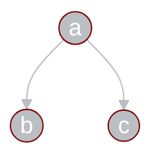

# Mermaid

[流程图语法 | Mermaid 中文网 (nodejs.cn)](https://mermaid.nodejs.cn/syntax/flowchart.html#google_vignette)

```mermaid
%%{
  init: {
    'theme': 'base',
    'themeVariables': {
      'primaryColor': '#BBBFC4',
      'primaryTextColor': '#fff',
      'primaryBorderColor': '#7C0000',
      'lineColor': '#F8B229',
      'secondaryColor': '#006100',
      'tertiaryColor': '#fff',
      'fontSize': '18px',
      'lineColor': '#BBBFC4',
      'fontFamily': 'arial'
    }
  }
}%%
graph TD
	a((a)) --> b((b)) & c((c))
	
```

