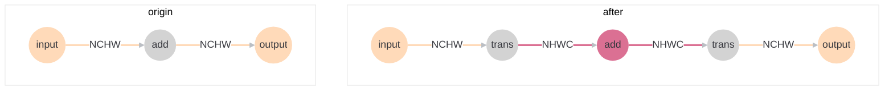

```mermaid
%%{
  init: {
  	'curve': 'basis',
    'theme': 'base',
    'themeVariables': {
      'primaryColor': '#fff', 
      'primaryTextColor': '#37383E',
      
      'lineColor': '#BBBFC4',
      'fontFamily': 'arial',
      'tertiaryColor': '#fff'
    },
    'flowchart': {
    	'curve': 'basis'
    }
    
  }
}%%
%% 节点背景颜色和节点字体颜色 `primaryColor`, `primaryTextColor`
%% style fill:lightgrey 浅灰色
%% style fill:palegoldenrod 苍麒麟色。
%% style fill:palegreen 苍绿色。
%% style fill:paleturquoise 苍绿色。
%% style fill:palevioletred 苍紫罗蓝色。
%% style fill:pansy 紫罗兰色。
%% style fill:papayawhip 番木色。
%% style fill:peachpuff 桃色。

flowchart TB
  classDef default stroke:#000, stroke-width:0px
  linkStyle default stroke:#BBBFC4, stroke-width:3px
  A(("&nbspinput&nbsp"))
  B(("&nbspadd&nbsp"))
  C(("output"))
  
  D(("&nbspinput&nbsp"))
  E(("trans"))
  F(("&nbspadd&nbsp"))
  G(("trans"))
  H(("output"))
  
  subgraph after
		D--"NCHW"-->E--"NHWC"-->F--"NHWC"-->G--"NCHW"-->H
	end

	subgraph origin
		A--"NCHW"-->B--"NCHW"-->C
	end
	
	style A fill:peachpuff;
	style B fill:lightgrey;
	style C fill:peachpuff;
	
	style D fill:peachpuff;
	style E fill:lightgrey;
	style F fill:palevioletred;
	style G fill:lightgrey;
	style H fill:peachpuff;
	
	linkStyle 0 stroke:peachpuff, arrowColor:#E7D95E, stroke-width:3px
	linkStyle 3 stroke:peachpuff, arrowColor:#E7D95E, stroke-width:3px
	linkStyle 1 stroke:palevioletred, arrowColor:#E7D95E, stroke-width:3px
	linkStyle 2 stroke:palevioletred, arrowColor:#E7D95E, stroke-width:3px
	
	linkStyle 4 stroke:peachpuff, arrowColor:#E7D95E, stroke-width:3px
	linkStyle 5 stroke:peachpuff, arrowColor:#E7D95E, stroke-width:3px
	
	
	
	
	
	
```

