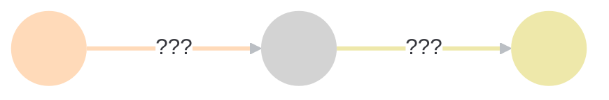
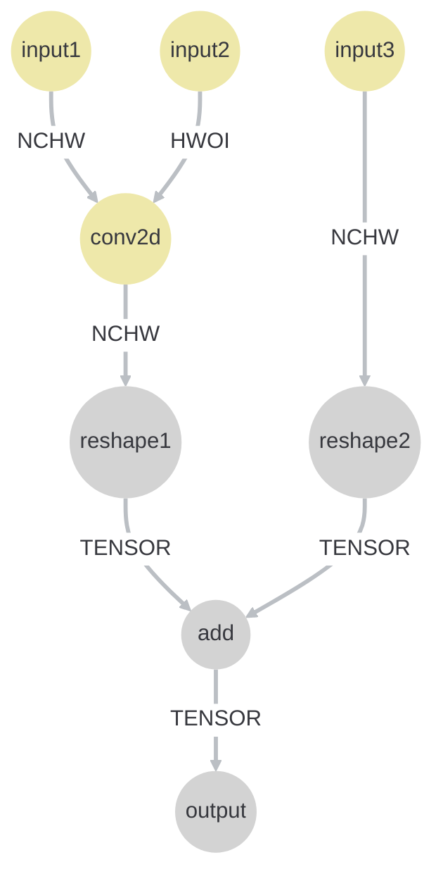
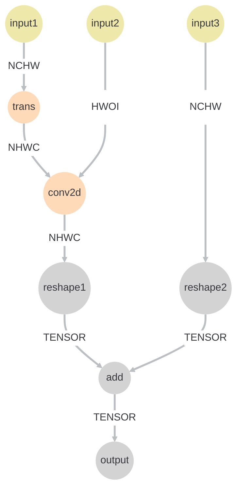
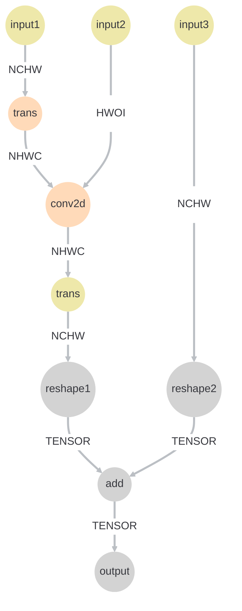
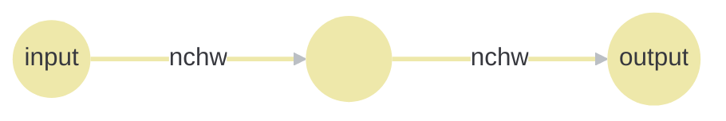

# LayoutPresetToNPU方案

## 背景

NPU对Conv/BPA/BPW关键算子，有layout限制（NHWC+HWOI）， 在LayoutTransmit阶段只对Layout进行了传播， 并没有严格限制这几类算子的Layout，所以需要针对不满足NPU前置条件的Conv/BPA/BPW算子插入transpose， 将其layout转换为满足条件 的格式

目前明确的需要NHWC或者HWOI的算子（根据硬件算子清单描述记录）：

`Conv/BPA/BPW`, `img2col`, `unpool`, `maskunpool`, `mirror`, `rotate`, `nchw2nhwc`, `nhwc2nchw`, `concat`, `pad`, `tensornorm`, `bilinear`

## 原则

1. 尽可能少的插入transpose
2. 关键算子的layout需要满足条件
3. 不能改变Tensor类的layout的数据排布

## 问题分析

### 多模态

多模态的情况下，CNN类layout与Tensor类Layout共存

### layout变化规律




算子的layout前后可能有如下变化：

1. 前置节点为CNN类型，后置节点为CNN类型

2. 前置节点为CNN类型，后置节点为Tensor类型

3. 前置节点为Tensor类型，后置节点为CNN类型

4. 前置节点为Tensor类型，后置节点为Tensor类型

### 针对layout变化的解决方法

理想情况是一个IR， 从其输入到输出的layout都是相同的，或者说是不冲突的，并且layout是符合硬件需求的，这种情况下不需要进行transpose节点的插入，这里将不满足条件的CNN类型layout看作是冲突节点，需要插入transpose解决冲突，针对于上述四种情况，进行详细分析：

#### 第一种情况（CNN->CNN）

该情况的处理主要取决于当前算子对layout的要求， 若要求NHWC或者HWOI但是输入layout并不满足条件，则需要将输入layout进行转换，输出不做处理

#### 第二种情况（CNN->Tensor）

这种情况下，我们需要记录当前Op的输入layout，在前方插入一个由NHWC转向当前输入layout的transpose,目的在于保证当前算子后续的算子的数据排布不发生改变

说明：

假设有以下IR:



 conv2d需要输入layout为NHWC， 所以会在input1之后插入一个transpose, 该transpose会导致reshape1的输入layout也变成NHWC，此时，add的两个输入的layout已经不一致了，虽然看起来都是Tensor类型， 但是实际上一个是NCHW排布， 一个是NHWC排布



正确做法如下：




#### 第三种情况(Tensor->CNN)

当前Op不做特殊处理

#### 第四种情况

当前Op不做特殊处理

## 解决思路

当前问题有以下几个解决思路：

### 记录插入点位置统一插入

#### 思路

这也是当前算法的做法， 首先扫描ir， 记录输入方向上的插入节点和输出方向上的插入节点， 对于中间节点为Tensor->CNN类型的节点也视为插入节点

通常来说，一个算子的输出layout可以由输入layout确定， 所以这里固定了input进来的layout之后可以顺序推导出后面算子的layout，并且可以确保符合要求，但是存在特殊情况， 若一个算子的layout变化是由Tensor->CNN,无法根据前置节点的layout信息进行推导，所以这里也应该独立判断， 对于输出节点的插入是因为输出的布局已经确定无法更改，所以需要插入transpose进行调和, 以下为示例



经过上述算法的插入后会得到下图所示ir：

```mermaid
%%{
  init: {
  	'curve': 'basis',
    'theme': 'base',
    'themeVariables': {
      'primaryColor': '#fff', 
      'primaryTextColor': '#37383E',
      
      'lineColor': '#BBBFC4',
      'fontFamily': 'arial',
      'tertiaryColor': '#fff'
    },
    'flowchart': {
    	'curve': 'basis'
    }
    
  }
}%%
%% 节点背景颜色和节点字体颜色 `primaryColor`, `primaryTextColor`
%% style fill:lightgrey 浅灰色
%% style fill:palegoldenrod 苍麒麟色。
%% style fill:palegreen 苍绿色。
%% style fill:paleturquoise 苍绿色。
%% style fill:palevioletred 苍紫罗蓝色。
%% style fill:pansy 紫罗兰色。
%% style fill:papayawhip 番木色。
%% style fill:peachpuff 桃色。

flowchart LR
  classDef default stroke:#000, stroke-width:0px
  linkStyle default stroke:#BBBFC4, stroke-width:3px
  A(("input"))
  B(("&nbsp&nbsp&nbsp&nbsp&nbsp&nbsp&nbsp&nbsp&nbsp"))
  C(("output"))
  D(("trans"))
  E(("trans"))
	style A fill:palegoldenrod;
	style B fill:peachpuff;
	style C fill:palegoldenrod;
	style D fill:peachpuff;
	style E fill:peachpuff;
	
	A--nchw--->D--nhwc--->B--nhwc--->E--nchw--->C
	linkStyle 0 stroke:palegoldenrod, arrowColor:#E7D95E, stroke-width:3px
	linkStyle 3 stroke:palegoldenrod, arrowColor:#E7D95E, stroke-width:3px
	
	linkStyle 1 stroke:peachpuff, arrowColor:#E7D95E, stroke-width:3px
	linkStyle 2 stroke:peachpuff, arrowColor:#E7D95E, stroke-width:3px
	
	
```



#### 存在的问题

1. 这里注意到，并不是所有的算子都必须要求nhwc或者hwoi的layout，若一条输入到输出的路径，其途径节点不包含特殊需求的算子，其实并不需要插入
2. 对于原图中已经存在的transpose节点，该方法不能很好的进行处理，因为transpose会改变CNN类型layout的布局，即使输入节点已经按照要求预设为NHWC，但是在经过transpose之后它的layout仍然是未知，一个简单的解决方案是将transpose节点也视为插入点，将transpose之后的layout转换为NHWC或者HWOI
3. 对于CNN->TENSOR类型的算子并没有做处理，当前的做法是全部统一成NHWC模式，可能会掩盖问题，但是不排除特殊情况会暴露出该问题

### 贪心算法

第一种算法的逻辑是先记录位置，在插入，最后统一更新layout

使用贪心算法的大致思路是从图的输 入开始遍历， 针对于每一个op，判断更新后的layout是否能够满足自身的需求， 若无法满足，则在算子前方插入transpose进行layout转换， 然后调用inferlayout更新自身layout，将当前layout向下传递

注意：每个算子只需要注意自己的operand是否需要进行插入即可

使用贪心算法能够很好的解决上述算法存在的问题，并且有很好的拓展性，缺点是需要明确每个算子的layout需求

## 算法概述

- 遍历全图，记录所有CNN->TENSOR类型的算子的原始layout
- 根据拓扑顺序遍历算子
- 对于每一个算子，查询是否是否需要在前方插入transpose
- 如果需要进行插入， 则插入transpose节点，否则则跳过
- 更新layout

## 实现细节

#### 数据结构及函数接口设计

```c++
// 以下类用于辅助对op进行判断和处理
class PresetHelper {
  // 判断算子的layout是否是CNN类型的layout
  bool static isCNNLayout(Operation* op);
  // 判断算子的layout类型（CNN类）是否为硬件要求的类型（HWOI或者NHWC）
  bool static isHardwarePresetLayout(Operation* op);
  // 判断算子是否对layout有需求
  bool static hasLayoutDemand(Operation* op);
  // 检查算子前置是否要插入transpose
  bool static needInsert(Operation* op)；
  // 插入transpose
  void static insertTranspose(Operation* op);
  // 主要用于收集layoutMap_信息
  void static collectInfo(funcOp* funcOp);

  // 当needInsert为true的时候会设置index，表示当前算子的第几个输入需要插入
  static std::vector<int> index；
  // 用于保存CNN->TENSOR类型的op的原始layout
  static std::map<Operation*, std::string> layoutMap_;
}
```

#### 函数流程

```c++
void runOnOperation() {
	auto funcOp = getFuncOp();
  
  PresetHelper::collectInfo();
  
  funcOp.walk([](Operation* op){
  	if (PresetHelper::needInsert(op)) {
    	PresetHelper::insertTranspose(op);
    }
    op.inferlayout();
  });
}
```

#### needInsert接口实现

该函数的功能是判断当前op是否需要在前方插入transpose

1. 第一个需要知道的是每个算子是否有要求必须是NHWC或者HWOI的layout， 若有要求且更新后的layout不满足要求，则需要进行插入， 否则不需要插入

2. 若该op是CNN->TENSOR类型的， 检查其原始layout和当前推导layout是否相同， 若相同则不需要插入， 若不相同则需要插入由当前layout转换为原始layout的transpose
3. 若算子含有多个输入，并且其layout不同则需要插入

#### hasLayoutDemand的实现

这里可以根据算子文档设计一个map去查询， 当前已知有需求的算子如下：

`Conv/BPA/BPW`, `img2col`, `unpool`, `maskunpool`, `mirror`, `rotate`, `nchw2nhwc`, `nhwc2nchw`, `concat`, `pad`, `tensornorm`, `bilinear`

#### insertTranspose的实现

这里的插入点是在当前op的第index个operand上进行插入， 首先需要拿到该operand的defineOp的layout， 然后将其转换为NHWC或者HWOI格式，具体需要结合defineOp的layout进行判断， 在插入完成之后需要进行参数正确替换

## 特殊情况分析

#### input到output路径中不存在有特殊需求的算子

这种情况下由于每次都是先去查询算子是否有特殊需求，然后在去判断是否需要插入，所以当一条路径上没有有需求的算子的时候，不会插入额外的tarnspose

#### transposeOp的处理


#### 单输入Op的处理


#### 多输入Op的处理

##### V_VV

由于输入可能来自于不同的方向，所以经过变换后很可能当前算子的多个输入layout已经不在一致， 这里需要插入transpose进行统一

#### V_VS

若V和S均为CNN的layout，需要将layout对齐

若V和S均为Tensor的layout，不需要处理

若V为CNN类， S为Tensor类

