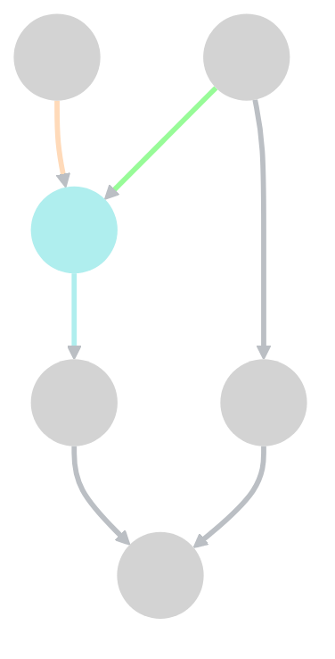
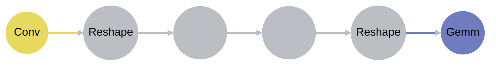
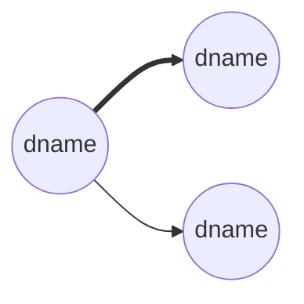

# LayoutTransmit方案

## 背景

1. 当前Pass某些算子的输入输出Layout类型已知（Conv，Gemm，QuantConv，QuantGemm）
2. 需要从已知Layout类型的算子出发推导全图Layout

## 方案简介

### 模型抽象

将ir看作一个有向图，图有多个输入多个输出，中间节点有多个输出，但只有单个输出，有以下限制：

1. 已知中间某些点的输入边的颜色和输出边的颜色
2. 某些节点无法通过输出边的颜色推导输入边的颜色（Reshape， BroadCast）
3. 当一个节点的所有输入边的颜色都确定的时候可以推导其输出边的颜色

此时，将该问题抽象为一个图染色问题，从已知颜色的点出发，将全图的节点染色

### 问题分析

#### 简化版

>  当前模型的难点在于上述的第二点（某些节点无法通过输出边的颜色推导输入边的颜色），若把这个限制去除，模型将会得到简化

由于中间节点仅有一个输出，并且不存在从输出无法推导输入的情况（已经假设去除了），该情况下我们仅需一次反向遍历，从已知颜色的节点出发向上推导，即可推导整个图的所有输入的颜色，当然也存在以下情况，可能某些输入-->输出的路径上并不含有已知颜色的节点，这种情况下我们可以给输入赋予一个默认值，没有已知颜色的节点的另一层含义是这条路径上的颜色没有任何限制

根据上述条款3，所有的输入颜色都知道了以后可以推导输出的layout，这时候只需要正向的遍历一次即可推导出全图的颜色

下图是一个示例，其中已知蓝色节点的输入和输出边的颜色




反向推导出输入的颜色：


正向推导出后续节点的颜色：


#### 完整版

当补全条款2的规则时，问题将会变得复杂，因为存在无法推导的节点

>  对于节点（Reshape， BroadCast）无法向上推导的原因是因为存在`多模态`的情况，通俗来说就是Gemm和Conv同时存在， Gemm更偏向于NTensor类型的layout， Conv偏向于Tensor类型的layout
>
>  NTensor类型的数据的维度是3~6维， Tensor类型的数据维度是0~6维， 这两种数据格式在维度为3~6维的时候有重叠，所以逆向的推导无法确定具体采用哪一种layout，之前的做法是向上和向下搜索最近的已知layout节点的类型来对layout进行赋值

当遇到这种算子的时候有以下解决方法：

1. 根据后续路径上出现的已知layout节点的类型进行判断
2. 根据前置路径上出现的已知layout节点的类型进行判断
3. 综合判断（分析前后节点的深度，深度最小的优先）

其实采用上的任何一种方案效果都差不多，因为我们无法预测这种节点前后算子的类型及深度，若采用第三种判断方案，该算子也无法同时满足前后两种不同类型算子的需求， 可能在某一种情况下能取得最优的性能，但是倘若前后算子调换一个方向那岂不是性能最差的选择？并且，递归的查找前后已知layout算子的过程会有很大的开销，尤其是网络模型太大的时候这个开销甚至无法容忍

综上所述，我们考虑第一种和第二种方案，那么又回到了如何确定该类型节点颜色的问题，往前看还是往后看？

##### 第一种方案（往后看）

对于往后看的情况又可以细分为：

###### 反向遍历的时候往后看

在反向遍历到当前节点，并且无法往前推导， 需要往后查询算子类型的时候， 我们很直观的会想到以下方法

- 递归查找

- 使用数据结构存储信息，直接访问

对于第一种，若图结构过于复杂可能会导致递归深度太深导致栈溢出或者效率太慢的问题

对于第二种，我们需要额外的定义数据结构， 并且在进行图染色之前需要提前遍历整个图以收集信息， 这里给出一个简单方案：

---

首先定义以下数据结构

```c++
class Node {
  public：
    Node(Operation* op) {

    }
    Operation* currentOp;
  
  	Operation* preKnownLayoutOp{nullptr};
  	Operation* nextKnownLayoutOp{nullptr};
  	std::set<Operation*> nextOps;
  	std::set<Operation*> preOps;
}
```

为了加快索引， 定义以下结构：

```c++
std::map<Operation*, Node>> relationMap;
```

使用两次遍历的方法， 第一次从上往下，第二次从下往上

```c++
// 从上到下， 寻找前置节点信息
funcOp->walk(Operation* op) {
  for (auto user : op->users) {
    relationMap[op].nextOps.insert(user);
    relationMap[user].preOps.insert(op);
    // 传递信息， 如果当前节点是已知layout节点，更新信息，如果不是则使用前置节点的信息
    if (isa<convOp,gemmOp, quantConvOp,quantGemmOp>(op)) {
      relationMap[op].preKnownLayoutOp = op;
    } else {
      for (auto preOp : relationMap[op].preOps) {
        if (relationMap[preOp].preKnownLayoutOp != nullptr) {
          relationMap[op].preKnownLayoutOp = relationMap[preOp].preKnownLayoutOp;
        }
      }
    }
  }
}


// 从下到上， 寻找后置节点信息
funcOp->reverse_walk(Operation* op) {
  for (auto define : op->defineOps) {
    relationMap[op].preOps.insert(define);
    relationMap[define].nextOps.insert(op);
    // 传递信息， 如果当前节点是已知layout节点，更新信息，如果不是则使用后置节点的信息
    if (isa<convOp,gemmOp, quantConvOp,quantGemmOp>(op)) {
      relationMap[op].nextKnownLayoutOp = op;
    } else {
      for (auto preOp : relationMap[op].nextOps) {
        if (relationMap[preOp].nextKnownLayoutOp != nullptr) {
          relationMap[op].nextKnownLayoutOp = relationMap[preOp].nextKnownLayoutOp;
        }
      }
    }
  }
}
```

算法需要两次遍历，复杂度为O(2n)

---


###### 正向遍历的时候往后看

在正向遍历到当前节点，并且无法往前推导， 需要往后查询算子类型的时候， 其实现方法和上一段描述一样， 这里不作赘述

- 递归查找

- 使用数据结构存储信息，直接访问

##### 第二种方案（往前看）

同样分为两种情况：

###### 反向遍历的时候往前看

这种情况同样的，一种思路是递归查找， 另一种是查表

###### 正向遍历的时候往前看

正向遍历往前看乍一看和反向遍历往后看没什么区别，都是往推导的反方向看

但是实际上，正向遍历可以将颜色进行传递， 根据条款3（当一个节点的所有输入边的颜色都确定的时候可以推导其输出边的颜色）我们可以将前置节点的颜色在遍历的过程中链式的传递下来，例如前方是一个CONV类型的节点，那么往后传递的将会一直是CNN类的layout或者Tensor类的layout， 然后如果遇到不可推断的节点的时候，可以通过该节点将layout转换为后置节点所需的layout，注意， 这里的reshape后续节点的layout已知，是在第一次反向推导的时候推断出来的

例如：

Conv(NHWC)-->(NHWC)Reshape(NTensor) -->Gemm(NTensor)

在反向传递的时候，我们无法做到这种自然的过度，例如：

Conv(NHWC)<--(？)Reshape(NTensor) <--Gemm(NTensor)

> 综上所诉， 我们采用正向遍历往前看的策略推断这种类型节点的颜色

##### 示例

下图是一个示例， 图中存在无法推断的节点（Reshape）：


在第一次反向推导的时候，该reshape的颜色无法推断，我们直接跳过，对于最下方的路径， 我们给一个默认值，得到以下结果：


此时进行一次正向推导， 得到如下结果：


### 算法概述

- 首先反向遍历有向图（以图的拓扑序的反序），若发现当前节点的颜色已知，则推导其前置节点的颜色，若前置节点颜色无法确定，则跳过
- 检查所有的输入节点， 若颜色位置， 赋予默认颜色
- 然后正向遍历有向图（拓扑序），若当前节点颜色未知， 根据其前置节点的颜色推断当前节点颜色

### 算法步骤

流程图如下：


## 实现细节

### 正反向遍历的实现

### 输入节点默认值的确定

### 多个连续无法推断节点的处理

多个连续无法推断的节点指以下情况：



当反向推导的时候，Gemm无法得到

### 多模态处理




